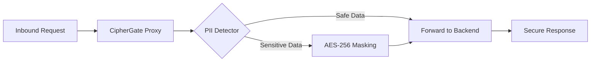

# CipherGate Security Proxy

[](https://python.org)
[](https://github.com/PkLavc/cipher-gate)
[](LICENSE)

## Overview

CipherGate Security Proxy is an enterprise-grade Zero-Trust security solution designed to protect sensitive data in transit. This production-ready implementation provides comprehensive data protection, authentication, and monitoring capabilities for modern digital infrastructure.

### Core Security Principles

- **Verify Explicitly**: Every request undergoes cryptographic authentication and authorization
- **Least Privilege Access**: Role-based data masking and access control
- **Assume Breach**: Continuous monitoring with tamper-proof audit trails
- **Cryptographic Protection**: Military-grade encryption with integrity verification

## Technical Architecture

### Security Workflow


### Core Components

#### 1. Security Proxy (`proxy.py`)
- **FastAPI-based high-performance proxy server**
- **Zero-Trust middleware implementation**
- **Request/response interception and validation**
- **Role-based access control integration**

#### 2. Cryptographic Vault (`crypto_vault.py`)
- **AES-256-GCM encryption for data at rest**
- **HMAC-SHA256 for data integrity verification**
- **RSA-2048 for token signing and validation**
- **Secure key generation and management**

#### 3. Dynamic Data Masking Engine (`masking_engine.py`)
- **Automatic sensitive data pattern detection**
- **Role-based masking with multiple levels**:
  - **Full**: Complete data visibility (Admin)
  - **Partial**: First/last character preservation (User)
  - **Last Four**: Only last 4 digits visible (User)
  - **Masked**: Complete masking with asterisks (Guest)
- **Structure preservation**: Maintains data format and schema integrity

#### 4. Compliance Auditor (`compliance_auditor.py`)
- **Tamper-proof audit logging with cryptographic chaining**
- **GDPR/HIPAA compliance reporting**
- **Real-time security violation detection**
- **Immutable audit trail with integrity verification**

## Security Specifications

### Cryptographic Standards

- **AES-256-GCM**: Industry-standard encryption algorithm with authenticated encryption
- **HMAC-SHA256**: Cryptographic integrity verification using SHA-256
- **RSA-2048**: Digital signature and token validation with 2048-bit keys
- **Secure Random Generation**: Cryptographically secure key generation using `secrets` module
- **Luhn Algorithm**: PCI-DSS compliant credit card validation
- **ReDoS Mitigation**: Regular expression denial of service protection with input size limits

### Data Protection Standards

- **GDPR Compliance**: Data minimization, purpose limitation, and comprehensive audit requirements
- **HIPAA Compliance**: Protected Health Information (PHI) protection with technical safeguards
- **PCI-DSS Compliance**: Payment card industry data security standards implementation
- **NIST Zero-Trust Framework**: Full implementation of NIST SP 800-207 guidelines

### Key Management Architecture

#### Master Key Derivation
- Environment-based key generation with secure fallback mechanisms
- SHA-256 based key derivation for enhanced security
- Key isolation with separate keys for different cryptographic operations

#### Persistent Key Storage
- AES-256 encrypted storage for cryptographic keys
- File system permissions validation across platforms
- Cross-platform security measures for Windows and Unix-like systems

#### Key Lifecycle Management
- Cryptographically secure random key generation
- Comprehensive key integrity and format validation
- Runtime file system permission verification
- Secure memory handling with automatic wiping

## High-Concurrency Auditing

CipherGate's compliance auditing system is designed for enterprise-scale, high-throughput environments:

### Singleton Async Logger
- Thread-safe singleton pattern ensuring single instance across all threads and processes
- Intelligent event loop detection and reuse in FastAPI environments
- Background processing with asynchronous log writing to prevent blocking
- Queue-based architecture for non-blocking log processing

### Tamper-Proof Audit Trails
- Cryptographic chaining with each audit record linked to previous entries
- Immutable logging with write-once audit trail and integrity verification
- Real-time processing with sub-millisecond audit log processing
- Scalable storage with asynchronous file I/O for high-volume operations

### High-Throughput Performance
- Non-blocking I/O operations preventing critical application path blocking
- Optimized memory usage for large-scale deployments
- Seamless integration with FastAPI's event loop architecture
- Synchronous fallback for environments without running event loops

## Resilience Features

Comprehensive resilience mechanisms designed for production environments:

### Graceful Degradation
- Component failure handling with system continuity during individual component failures
- Automatic fallback to secure defaults when advanced features are unavailable
- Error isolation preventing component failures from cascading
- Service continuity ensuring core security functions remain operational

### File System Security
- Runtime validation of file system permissions for security-critical files
- Cross-platform support with platform-specific security measures
- Restrictive file permissions (600) for cryptographic key files
- Continuous monitoring of file system security posture

### Operational Resilience
- Restart persistence with cryptographic keys and configuration preservation
- Automatic state recovery after system failures
- Comprehensive health checks for all critical components
- Performance degradation handling while maintaining security

### Security Monitoring
- Real-time alerts for security violations and anomalies
- Continuous audit trail integrity verification
- Security operation performance monitoring
- Automated compliance report generation for regulatory requirements

## Compliance and Auditing

### Regulatory Alignment

| Regulation | Requirement | CipherGate Implementation |
| :--- | :--- | :--- |
| **GDPR** | Right to Privacy | Dynamic Data Masking (PII) |
| **HIPAA** | Technical Safeguards | AES-256 Encryption & Audit Trails |
| **PCI-DSS** | Payment Card Security | Luhn Algorithm & Card Masking |
| **NIST 800-207** | Zero-Trust Architecture | Continuous Verification Middleware |

### Audit Log Example
```json
{
  "event": "pii_masking_applied",
  "source_ip": "192.168.1.50",
  "endpoint": "/v1/user/data",
  "masked_fields": ["email", "credit_card"],
  "algorithm": "AES-256-GCM",
  "status": "success"
}
```

### Audit Trail Features

- Cryptographic chaining with each log entry cryptographically linked to previous
- Tamper detection with automatic detection of log modification attempts
- Real-time monitoring with live security event streaming
- Compliance reports with automated GDPR/HIPAA compliance reporting

### Security Monitoring

- Access pattern analysis for detection of unusual access patterns
- Security violation logging with automatic policy violation logging
- Performance monitoring with request latency and throughput metrics
- Error tracking with detailed error logging for troubleshooting

## Setup & Usage

### Prerequisites

- Python 3.11+
- pip package manager

### Installation

```bash
# Clone the repository
git clone https://github.com/PkLavc/cipher-gate.git
cd cipher-gate

# Install dependencies
pip install -r requirements.txt

# Start the proxy server
python proxy.py
```

### Configuration

The proxy runs on `http://localhost:8000` by default with the following endpoints:

- **Health Check**: `GET /health`
- **API Proxy**: `POST /api/proxy/{service_path:path}`
- **Documentation**: `GET /docs` (Swagger UI)

### Example Usage

```bash
# Test the proxy with sample data
curl -X POST "http://localhost:8000/api/proxy/test-service" \
  -H "accept: application/json" \
  -H "Content-Type: application/json" \
  -d '{
    "user": {
      "name": "John Doe",
      "email": "john.doe@example.com",
      "ssn": "123-45-6789"
    },
    "message": "Contact me at user@domain.com"
  }'
```

### Role-Based Access Control

CipherGate supports four user roles with different data access levels:

- **Admin**: Full data visibility
- **User**: Partial masking (first/last characters preserved)
- **Guest**: Complete masking
- **Auditor**: Full visibility for compliance monitoring

### Security Configuration

Set the master key environment variable for production deployments:

```bash
export CIPHERGATE_MASTER_KEY="your-64-character-hex-key-here"
python proxy.py
```

## Performance Characteristics

### Benchmarks

- **Encryption/Decryption**: < 100ms for 10KB payloads
- **Data Masking**: < 100ms for complex nested data structures
- **Token Validation**: < 10ms per request
- **Audit Logging**: < 1ms per log entry

### Scalability

- **Horizontal Scaling**: Stateless design supports load balancing
- **Memory Efficiency**: Minimal memory footprint per request
- **CPU Optimization**: Efficient cryptographic operations
- **Network Performance**: Minimal latency addition to proxied requests

## Development and Contribution

### Code Quality Standards

- Type hints for full maintainability
- Comprehensive docstrings and inline comments
- Security-focused test coverage
- Mandatory security review for all changes

### Security Development Lifecycle

1. Threat modeling with security requirements analysis
2. Secure coding following OWASP guidelines
3. Automated security test execution
4. Security-focused peer review
5. Secure deployment practices

## Support and Maintenance

### Security Updates

- Regular security audits with quarterly assessments
- Automated dependency updates and security patching
- 24-hour response to critical vulnerabilities
- Transparent security communication through advisories

### Professional Services

- Custom deployment assistance and implementation support
- Organization-specific security assessments
- Zero-Trust architecture training programs
- Regulatory compliance consulting

## Author

**Patrick - Computer Engineer**

To view other projects and portfolio details, visit:
[https://pklavc.github.io/projects.html](https://pklavc.github.io/projects.html)
